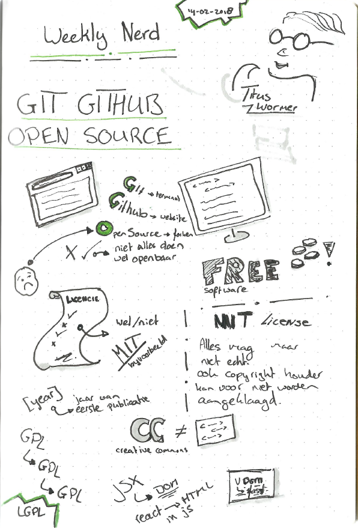
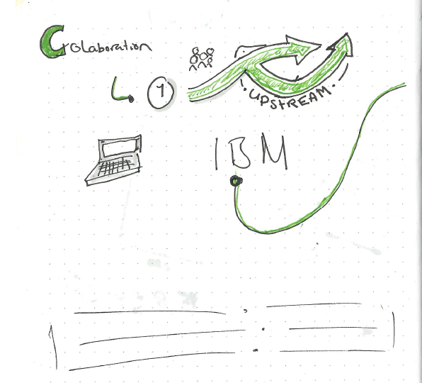
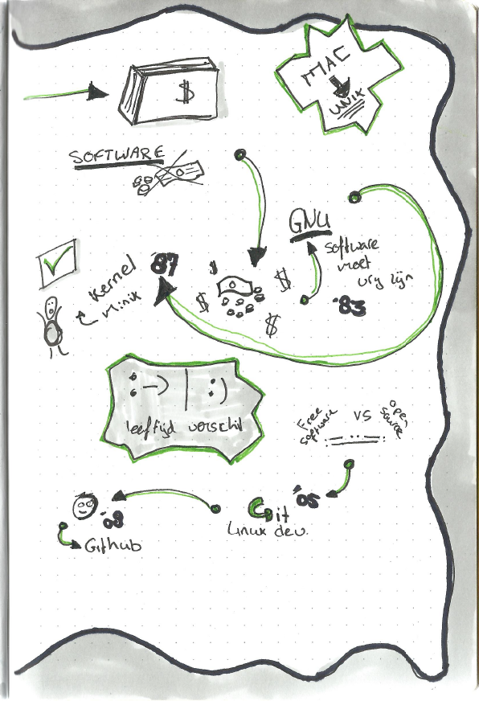

# 2. Titus wormer - Git

Titus Wormer verteld over Git en Github. Waar komt het vandaan en hoe werkt het. Wij moeten deze minor daar veel gebruik van maken dus krijgen we een klein college over Git.

## Sketchnotes

---

---

