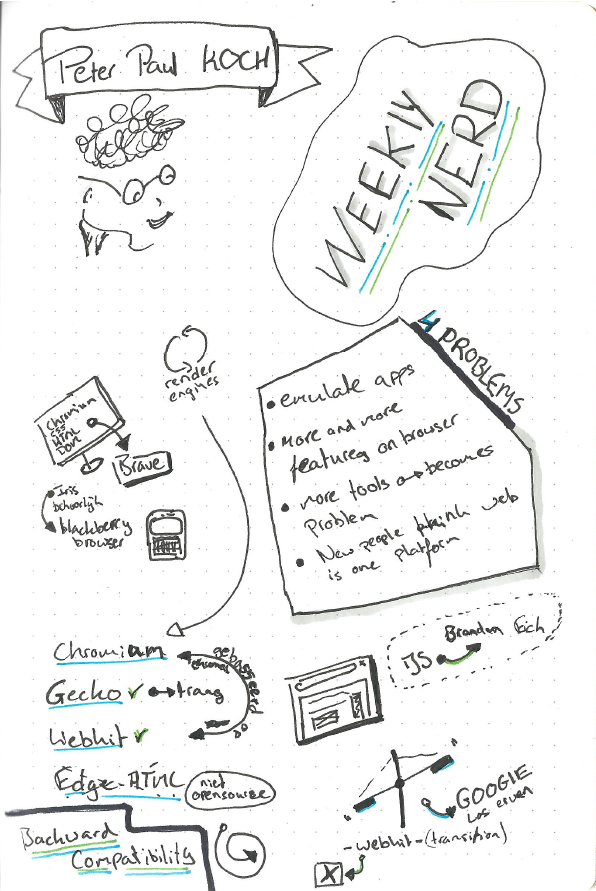
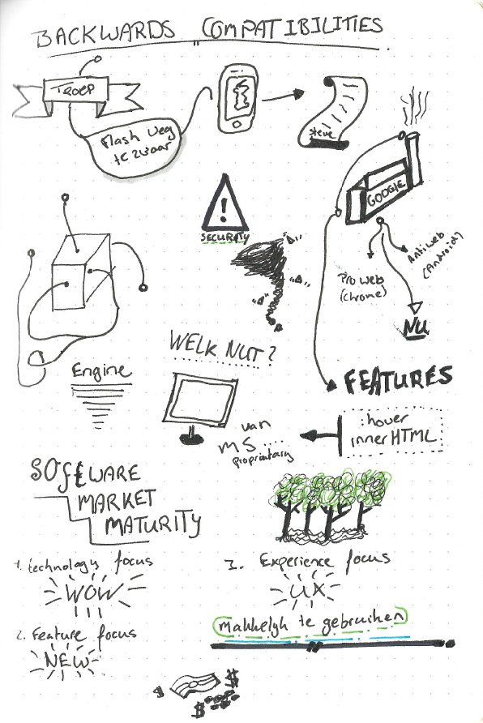

# 3. Peter Paul Koch - Browser Bloat

Peter Paul Koch geeft een presentatie over zijn idee over browsers. Tegenwoordig zijn er verschillende browser, maar dat maakt het voor een developer niet makkelijk. Hoe gaan wij met deze ontwikkeling om en hoe zouden we er mee om moeten gaan?

## Sketchnotes

---

