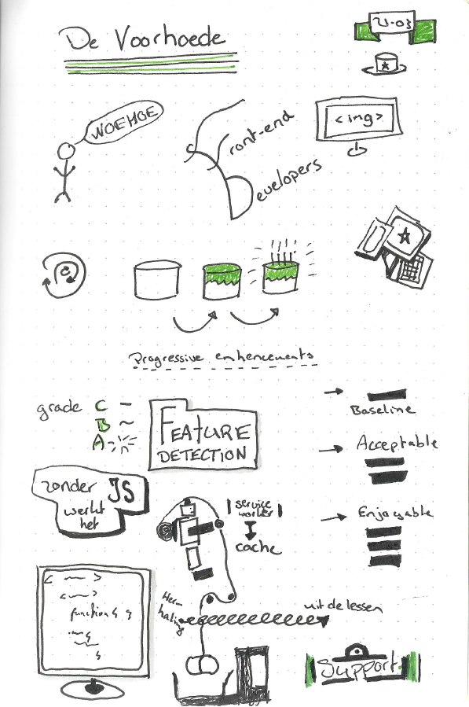
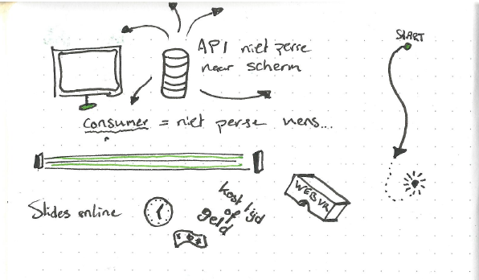

[Vorige](/Weekly-Nerd/4_TAMTAM.md) | [Volgende](/Weekly-Nerd/6_Schiphol.md)

# 5. Employees of De voorhoede

De Voorhoede geeft hun idee over progressive enhencement. Ze laten zien hoe zij dat toepassen en hoe zij werken met `feature detection`.  Naast deze uitleg mogen we ook zelf aan de slag met een oefening voor progressive enhencement.

## Sketchnotes

---

---

[Vorige](/Weekly-Nerd/4_TAMTAM.md) | [Volgende](/Weekly-Nerd/6_Schiphol.md)