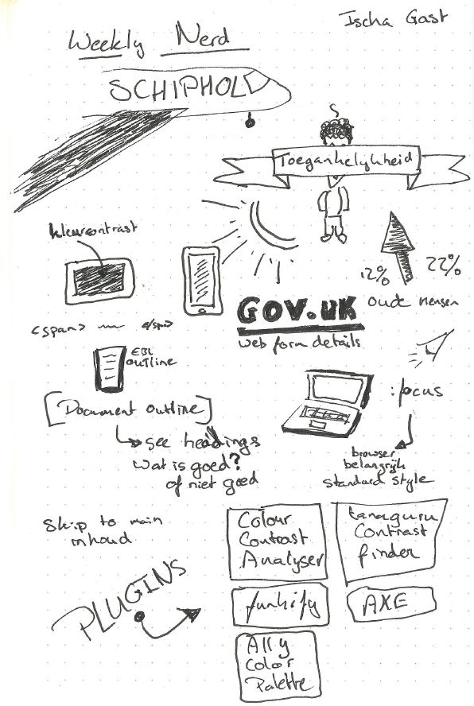
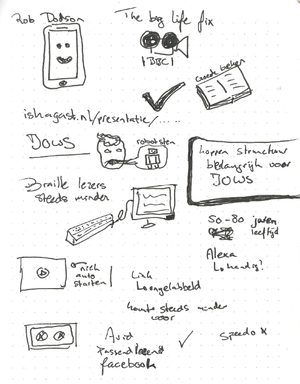

# 6. Ischa Gast - Schiphol - Accesibility

Bij schiphol krijgen wij een uitgebreide uitleg over accesibility. Er worden enkele voorbeelden laten zien en laten zien hoe er getest kan worden op accesibility. Een blinde man is aanwezig die laat zien hoe hij werkt op het web. 

## Sketchnotes

---

