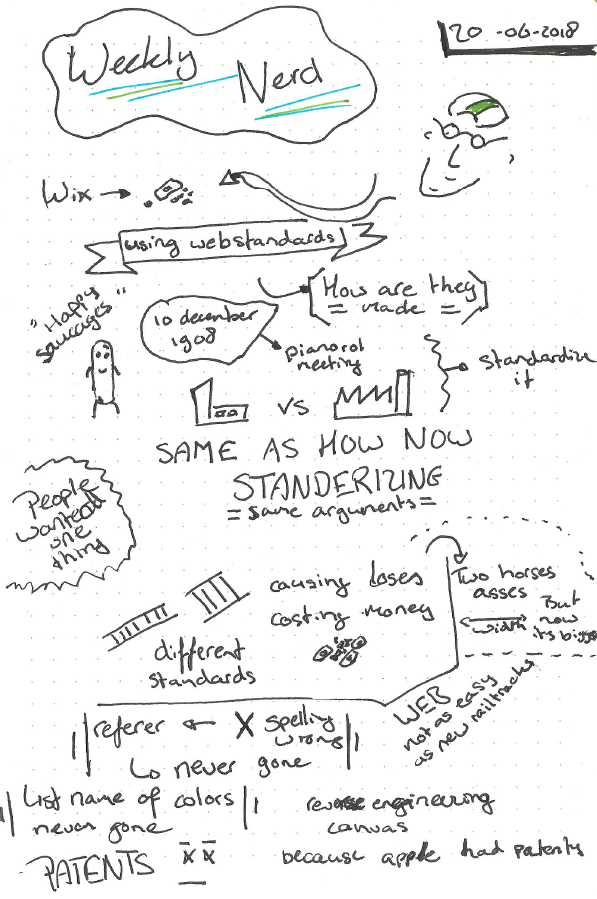
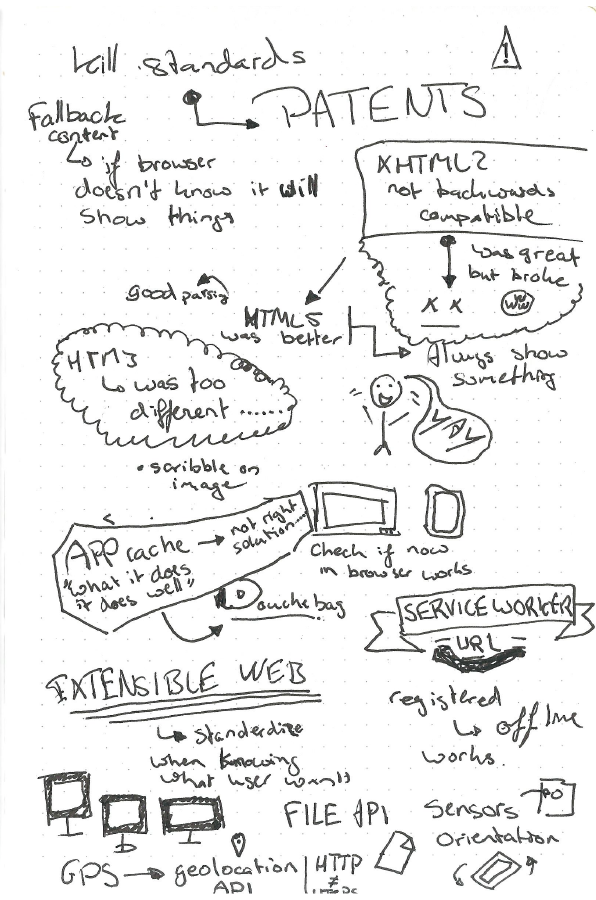
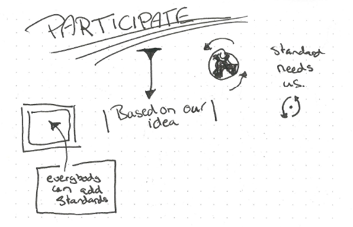

# 9. Bruce Lawson - Webstandards

Bruce Lawson, van W3C, verteld ons over webstandaarden. W3C schrijft de webstandaarden. Hij laat zien waar standaarden vandaan komen en hoe webstandaarden tegenwoordig worden geschreven.

## Sketchnotes

---

---

